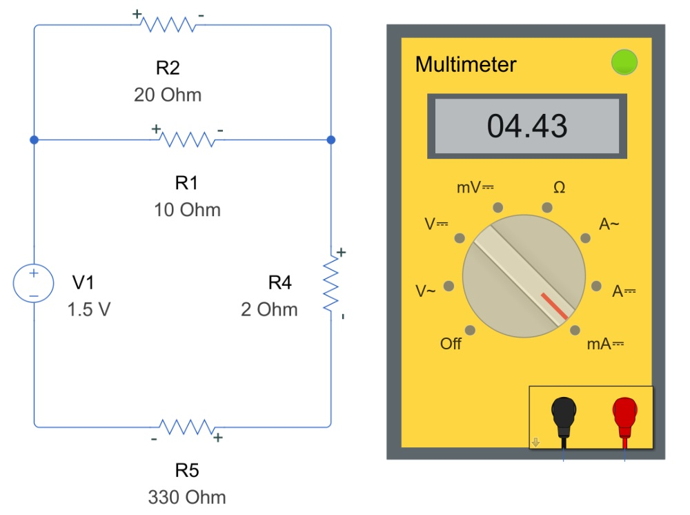

# Battery Systems: introduction 

 or 

**Curriculum Module**

_Created with R2024a. Compatible with R2024a and later releases._

# Information 

This curriculum module contains interactive [ MATLAB® live scripts](https://www.mathworks.com/products/matlab/live-editor.html) that contain learning material covering the fundamental concepts and terminology of battery systems. The focus is on designing and modeling battery systems using different tools (MATLAB, Simulink, and Simscape).

## Background

You can use these live scripts as demonstrations in lectures, class activities, or interactive assignments outside class. This module covers basic battery pack design, battery cell modeling (electrical and thermal), and the basics of battery management systems. It also includes examples of modeling using different approaches (MATLAB, Simulink, and Simscape) and State of Charge (SoC) estimation.

The instructions inside the live scripts will guide you through the exercises and activities. Get started with each live script by running it one section at a time. To stop running the script or a section midway (for example, when an animation is in progress), use the  Stop button in the **RUN** section of the **Live Editor** tab in the MATLAB Toolstrip.

## Contact Us

Contact the [MathWorks teaching resources team](mailto:onlineteaching@mathworks.com) if you would like to provide feedback, or if you have a question.

## Prerequisites

This module assumes knowledge of electrical circuits as discussed in [DC Circuit Analysis](https://github.com/MathWorks-Teaching-Resources/DC-Circuit-Analysis). There is minimal MATLAB knowledge required for these scripts, but you could use [MATLAB Onramp](https://matlabacademy.mathworks.com/details/matlab-onramp/gettingstarted) as a resource to acquire familiarity with live scripts and MATLAB syntax. Depending on your learning path through the module, you might want to add [Simulink Onramp](https://matlabacademy.mathworks.com/details/simulink-onramp/simulink) or [Simscape Onramp](https://matlabacademy.mathworks.com/details/simscape-onramp/simscape) to gain familiarity with these tools.

## Getting Started
### Accessing the Module
### **On MATLAB Online:**

Use the  link to download the module. You will be prompted to log in or create a MathWorks account. The project will be loaded, and you will see an app with several navigation options to get you started.

### **On Desktop:**

Download or clone this repository. Open MATLAB, navigate to the folder containing these scripts, and double\-click [BatterySystem.prj](https://matlab.mathworks.com/open/github/v1?repo=MathWorks-Teaching-Resources/Battery-Systems&project=BatterySystem.prj&file=README.mlx). It will add the appropriate files to your MATLAB path and open an app that asks you where you would like to start. 

Ensure you have all the required products (listed below) installed. If you need to include a product, add it using the Add\-On Explorer. To install an add\-on, go to the **Home** tab and select   **Add-Ons** > **Get Add-Ons**. 

## Products

This module uses all of the following products:

-  MATLAB® 
-  Simulink® 
-  Simscape™ 
-  Simscape Battery™ 
-  Simscape Electrical™ 
-  Symbolic Math Toolbox™ 
-  Curve Fitting Toolbox™ 
-  Statistics and Machine Learning Toolbox™ 

# Scripts
## [**EVBatteryDesign.mlx**](https://matlab.mathworks.com/open/github/v1?repo=MathWorks-Teaching-Resources/Battery-Systems&project=BatterySystem.prj&file=Scripts/EVBatteryDesign.mlx) 
|      |      |
| :-- | :-- |
|     | **In this script, students will...**   $\bullet$ Be able to understand battery configuration (parallel, series).   $\bullet$ Determine power and energy requirements for a battery pack.   $\bullet$ Validate their design through simulation.     |
|      |       |

## [**HowDoBatteryWork.mlx**](https://matlab.mathworks.com/open/github/v1?repo=MathWorks-Teaching-Resources/Battery-Systems&project=BatterySystem.prj&file=Scripts/HowDoBatteryWork.mlx)
|      |      |
| :-- | :-- |
|     | **In this script, students will...**   $\bullet$ Learn about the different components of a battery.   $\bullet$ Learn how batteries work.   $\bullet$ Build a functional model of a battery.     |
|      |       |

## [**BatteryModeling.mlx**](https://matlab.mathworks.com/open/github/v1?repo=MathWorks-Teaching-Resources/Battery-Systems&project=BatterySystem.prj&file=&file=FunctionLibrary/BatteryModeling.mlx)
|      |      |
| :-- | :-- |
|     | **In this script, students will...**   $\bullet$ Learn about battery modeling principles.   $\bullet$ Conduct experimental observations and data analysis.   $\bullet$ Develop and calibrate an equivalent circuit model for a battery cell.     |
|      |       |

## [**ThermalModeling.mlx**](https://matlab.mathworks.com/open/github/v1?repo=MathWorks-Teaching-Resources/Battery-Systems&project=BatterySystem.prj&file=Scripts/ThermalModeling.mlx)
|      |      |
| :-- | :-- |
|     | **In this script, students will...**   $\bullet$ Learn about battery thermal modeling principles.   $\bullet$ Develop a computation model of battery heating and cooling.   $\bullet$ Compare different heating and cooling scenarios.     |
|      |       |

## [**BatteryManagementSystem.mlx**](https://matlab.mathworks.com/open/github/v1?repo=MathWorks-Teaching-Resources/Battery-Systems&project=BatterySystem.prj&file=&file=FunctionLibrary/BatteryManagementSystem.mlx)
|      |      |
| :-- | :-- |
|     | **In this script, students will...**   $\bullet$ Learn about constant voltage and constant current charging.   $\bullet$ Develop algorithms to estimate a battery state of charge (SoC).     |
|      |       |

# Related Courseware Modules
## [ DC Circuit Analysis](https://matlab.mathworks.com/open/github/v1?repo=MathWorks-Teaching-Resources/DC-Circuit-Analysis&project=DCCircuitAnalysis.prj)
|      |      |
| :-- | :-- |
|     | **Available on:**          [GitHub](https://github.com/MathWorks-Teaching-Resources/DC-Circuit-Analysis)      |
|      |       |

Or feel free to explore our other [modular courseware content](https://www.mathworks.com/matlabcentral/fileexchange/?q=tag%3A%22courseware+module%22&sort=downloads_desc_30d).

# Educator Resources
-  [Educator Page](https://www.mathworks.com/academia/educators.html) 

# Contribute 

Looking for more? Find an issue? Have a suggestion? Please contact the [MathWorks teaching resources team](mailto:%20onlineteaching@mathworks.com). If you want to contribute directly to this project, you can find information about how to do so in the [CONTRIBUTING.md](https://github.com/MathWorks-Teaching-Resources/Battery-Systems/blob/release/CONTRIBUTING.md) page on GitHub.

 *©* Copyright 2024 The MathWorks™, Inc

